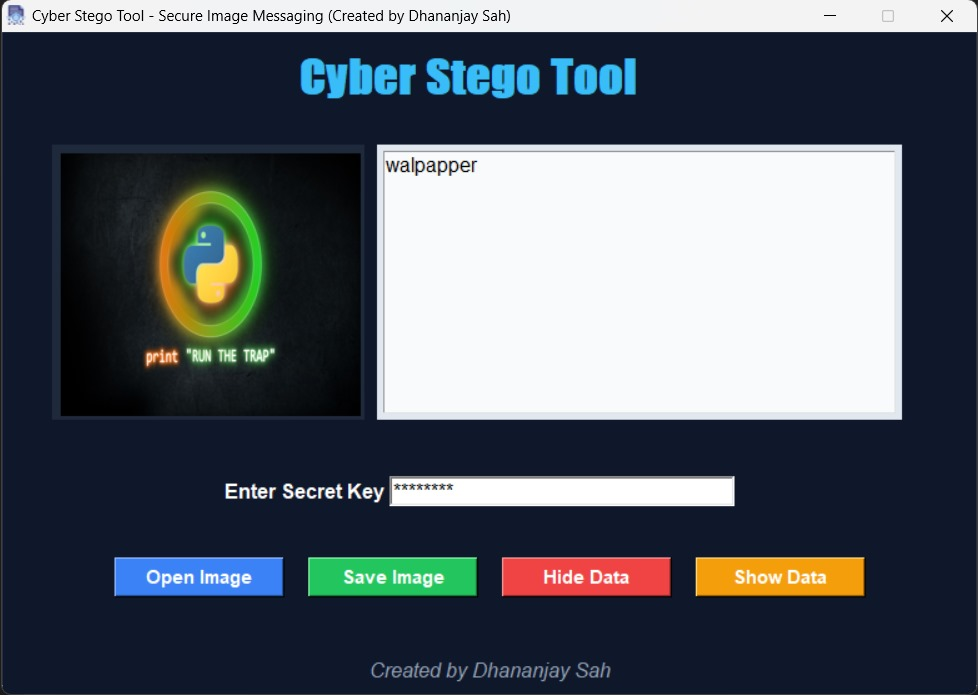

# 🛡️ **Cyber Stego Tool - Secure Image Messaging**

**Cyber Stego Tool** is a powerful and user-friendly Python application that leverages the combination of **AES encryption** and **LSB (Least Significant Bit) steganography** to securely hide encrypted messages inside images. Ideal for private and secure communications.

> 🔒 **Crafted with ❤️ by Dhananjay Sah**

---

## 📸 **Screenshot**



---

## 🚀 **Features**

- **📂 Drag & Drop** support for easy image uploads
- **🔐 AES Encryption (CBC Mode)** for secure message encryption
- **🖼️ LSB Steganography** to hide encrypted messages in `.png` or `.jpg` images
- **💾 Auto-downloads default images** (`photo.png`, `icon.ico`) if they don't exist in the working directory
- **🎨** Modern, animated GUI built using **Tkinter**
- **💡 Beginner-friendly interface** with smooth hover effects for easy navigation

---
**Cyber Stego Tool - Instructions for Windows**

1. **Download the Executable:**
   - [Download Cyber Stego Tool](https://yourdownloadlink.com/cyber_stego_tool.exe)

2. **Run the Executable:**
   - Double-click on the `.exe` file to start the application.

3. **How to Use the Tool:**
   - Follow the steps outlined in the README for hiding and revealing messages inside images using AES encryption and LSB steganography.
   - Make sure you have the correct secret key for decryption.

4. **System Requirements:**
   - Windows 7 or later
   - No additional dependencies needed, as the application comes packaged.

5. **Support:**
   - For any issues or feedback, contact us at [rootuserdj@gmail.com](mailto:rootuserdj@gmail.com).


## 🧩 **System Requirements**

- 🐍 Python 3.8 or later

### **Install Dependencies**

To get started, install the necessary Python libraries:

```bash
pip install pillow stegano pycryptodome
```

---

## 🧪 **How to Use**

1. **Run the Application**:
   ```bash
   python cyber_stego_tool.py
   ```

2. **Hiding a Message**:
   - Open an image (supports `.png` and `.jpg` formats)
   - Enter your secret message
   - Provide a secret key for encryption
   - Click on **Hide Data** to encrypt and hide the message
   - Save the newly generated image

3. **Revealing a Message**:
   - Open the image with the hidden message
   - Enter the corresponding secret key
   - Click on **Show Data** to reveal the hidden message

> ⚠️ **Note**: The correct secret key is required to successfully decrypt and reveal the hidden message.

---

## 📦 **Build an Executable (Optional)**

To create a Windows executable (.exe) for easy distribution:

1. Install `auto-py-to-exe`:

   ```bash
   pip install auto-py-to-exe
   ```

2. Launch the tool:

   ```bash
   auto-py-to-exe
   ```

3. In the tool:
   - Select **cyber_stego_allinone.py** as the script
   - Choose **One file mode**
   - Add the following files:
     - `includes/icon.ico` (App icon)
     - `includes/photo.png` (Default image)
   - Select **Window-based app** (No terminal window)
   - Click **Build** to generate the executable in the `output` folder

---

## 📁 **Project Structure**

```
CyberStego/
│
├── cyber_stego_tool.py       # Main Python script
├── README.md                 # This file
├── includes/
│   ├── icon.ico              # App icon
│   └── photo.png             # Default image
├── preview.png               # App screenshot
└── LICENSE                   # Project License
```

---

## 🧠 **Concept Behind**

The combination of **AES encryption** and **LSB steganography** makes your messages both **secure** and **invisible**:

- **AES Encryption** ensures the message is scrambled and requires a secret key for decryption.
- **LSB Steganography** hides the encrypted message within the image at the pixel level, making it virtually undetectable.

Together, they provide a robust solution for secure communication.

---

## 📜 **License**

This project is licensed under the **MIT License**. See the [LICENSE](LICENSE) file for more details.

---

## 🙌 **Acknowledgements**

- [Stegano Library](https://github.com/cedricbonhomme/Stegano)
- [PyCryptodome Library](https://github.com/Legrandin/pycryptodome)
- [Pillow Library](https://pillow.readthedocs.io/)

---

## 💬 **Feedback / Contact**

> **Developed by Dhananjay Sah**  
Email: [rootuserdj@gmail.com](mailto:rootuserdj@gmail.com)

If you find this project useful, please give it a ⭐️ and follow for updates!
